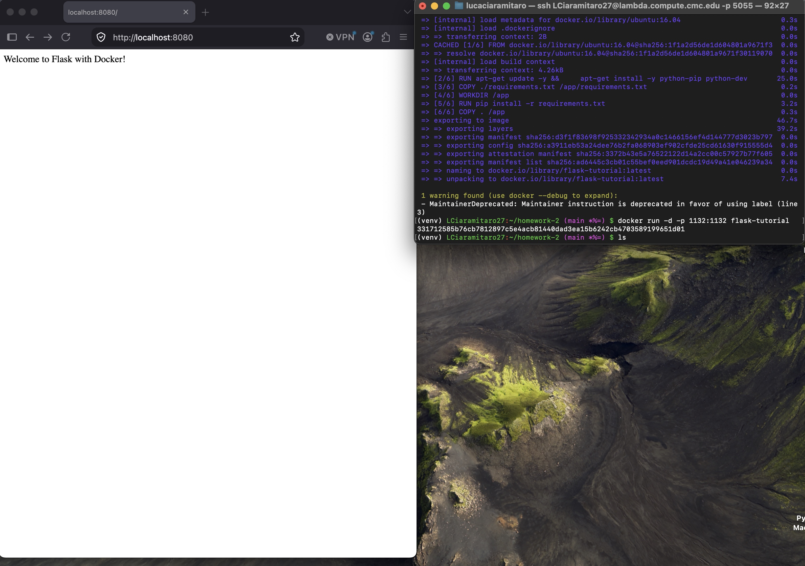

# Flask Docker Homework

This homework demonstrates how to build and run a Python Flask app with Docker. A tutorial from runnable.com was followed to complete this assignment. The tutorial uses python 2.7 instead of python3, providing us with a challenge to get the system running.

## Screenshot

